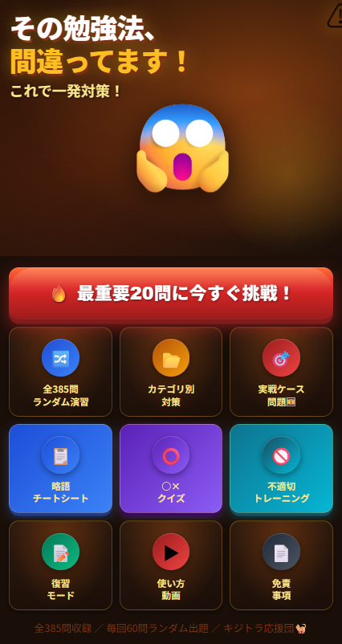

# 🐱 生成AIパスポート無料ドリル｜にゃんパス∞

👉 **https://mahitogawa.github.io/ai/**

生成AIパスポート試験に無料で合格するための対策アプリです。  
全462問・2026年新シラバス完全対応。スマホでもPCでも使えます。

---

## ⭐ 使ってみて良かったらスターお願いします！
GitHubの⭐が増えると開発の励みになります🙏

---

## 🚀 特徴
- **全462問**・毎回60問ランダム出題
- カテゴリ別演習で苦手分野を集中対策（8カテゴリ）
- 略語チートシート搭載（RAG・LLM・RLHF・MCP・XAIなど）
- 復習モード・フラグ機能つき
- 🐱 AI先生に質問できる（わからない問題をすぐ解説）
- ○×クイズ・不適切形式トレーニング・実戦ケース問題搭載
- 📋 にゃんログ（体調記録）・💙 こころのセルフチェックとも連携
- 2026年新シラバス完全対応（AI新法・EUのAI法・AIエージェント・MCPほか）
- PWA対応・オフライン利用可
- ネコの解説つき🐈

---

## 🎯 こんな人におすすめ
- 生成AIパスポート（GUGA）試験を受ける人
- スキマ時間で効率よく学びたい人
- クイズ形式で覚えたい人
- AI初心者・文系の方・シニアの方

---

## 📱 使い方
👇 今すぐ挑戦（スマホ・PC対応）  
👉 **https://mahitogawa.github.io/ai/**

---

## 🔗 関連アプリ
| アプリ | URL |
|--------|-----|
| 🤖 生成AIパスポート最強ドリル | https://mahitogawa.github.io/ai/ |
| 🐱 にゃんログ（体調記録） | https://mahitogawa.github.io/nyanlog/ |
| 💙 こころのセルフチェック | https://mahitogawa.github.io/nyanlog/mental.html |

---

## 🔥 クラウドファンディング実施中
脳梗塞を乗り越え作ったAI学習アプリを誰もが使えるAI学習アプリを届けたい！  
👉 **https://camp-fire.jp/projects/943911**

---

## ⚠️ 注意事項
このアプリはMahi-Mahiがリハビリと試験対策のために作成した個人制作の学習ドリルです。  
問題・解説の正確性は保証できません。  
最新情報はGUGA公式サイト（guga.or.jp）をご確認ください。
